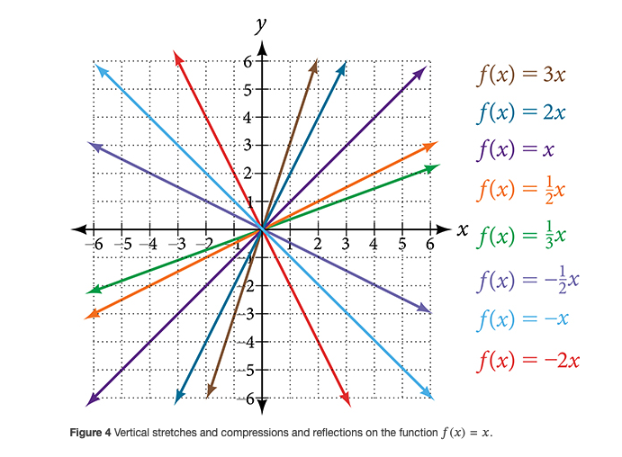
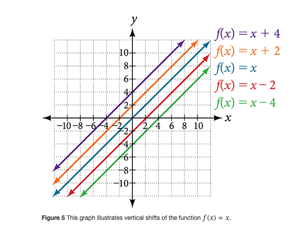
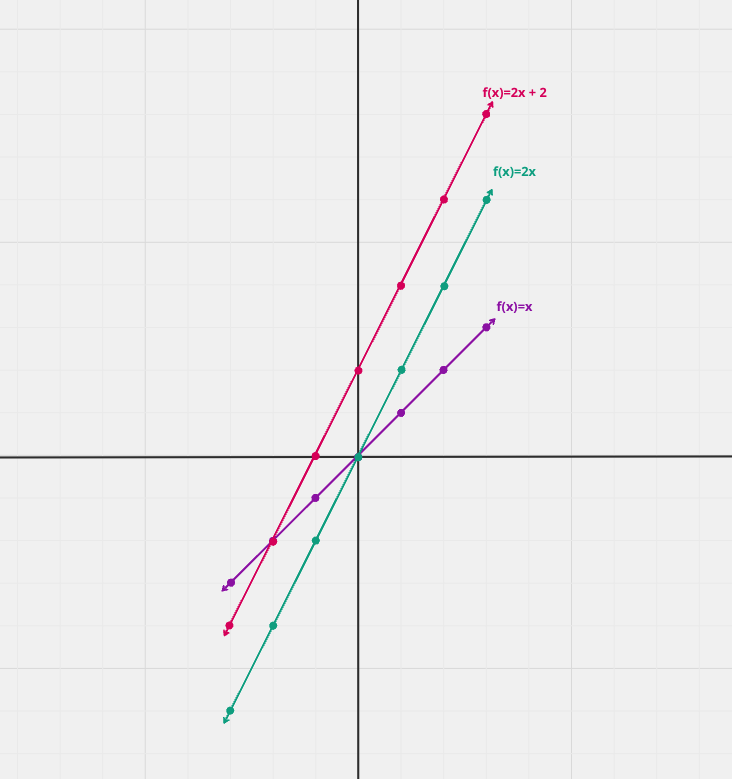
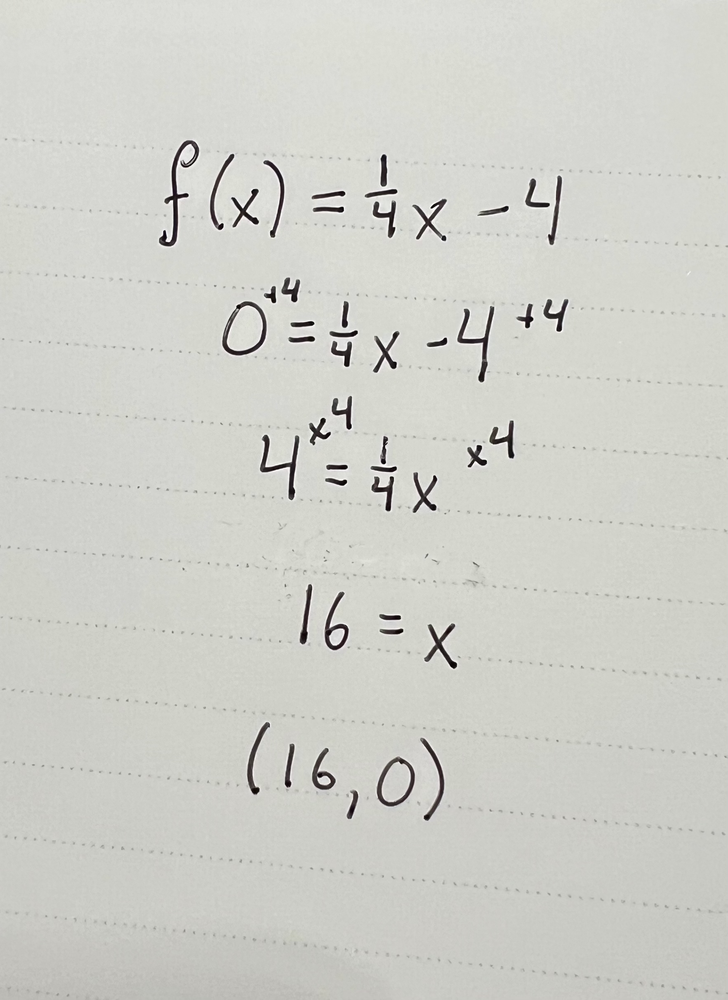
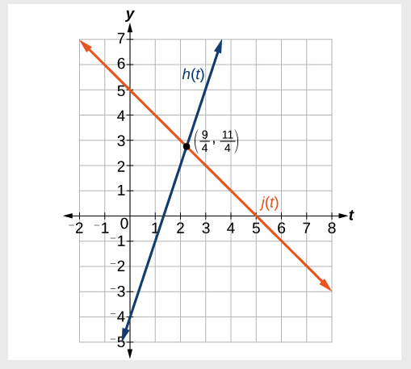
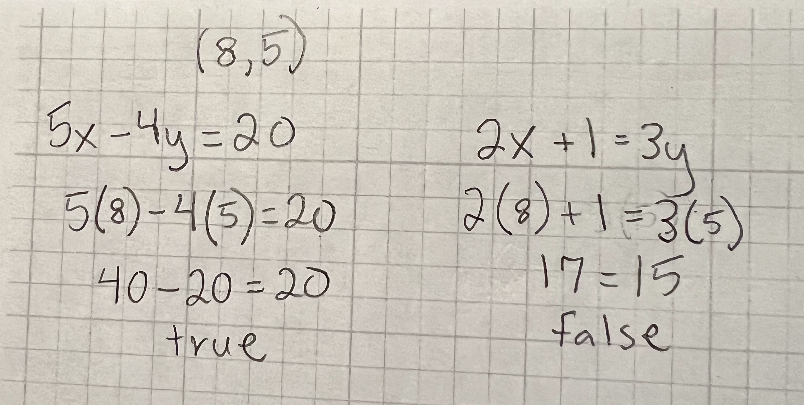

<h3 align="center"><a href="https://github.com/HexxKing/hexxs_study_notes#-1">👈 Back to Table of Contents</a></h3>

---

# Lines, Systems, and Piece-wise Functions

## Tasks

### Determine the equation of a line given its graph

  - Identify two points on the line, preferably where it intersects the x and y axes.
  - Calculate the slope using the formula: `m = (y2 - y1) / (x2 - x1)`
  - Use the slope and one of the points in the point-slope form: `y - y1 = m(x - x1)`
  - Solve for y to get the equation in slope-intercept form: `y = mx + b`

### Graph lines given their equation

  - Identify the slope (m) and y-intercept (b) from the equation.
  - Plot the y-intercept on the y-axis.
  - Use the slope to find a second point: move m units up (or down if negative) and 1 unit to the right from the y-intercept.
  - Draw a straight line through those two points.

### Find the equation of a line in slope-intercept form using point-slope form

  - Substitute the given point and slope into the point-slope form.
  - Distribute any coefficients and simplify.
  - Solve for y to get the equation in slope-intercept form.

### Determine the solution of a system of linear equations by graphing

  - Graph each equation on the same coordinate plane.
  - The solution is the point where the two lines intersect (if they do).

### Determine the solution of a system of linear equations by substitution

  - Solve one equation for one variable.
  - Substitute that expression into the other equation.
  - Solve the resulting equation for the remaining variable.
  - Substitute back into the first equation to find the value of the other variable.

### Determine the solution of a system of linear equations by elimination/addition

  - Manipulate the equations so that one variable has the same coefficient in both equations, but with opposite signs.
  - Add (or subtract) the equations to eliminate that variable.
  - Solve the resulting equation for the remaining variable.
  - Substitute back into one of the original equations to find the value of the other variable.

### Evaluate piecewise functions

  - Identify the appropriate piece of the function based on the input value.
  - Substitute the input value into the corresponding expression and evaluate.

### Graph piecewise functions

  - Graph each piece of the function separately on its corresponding domain.
  - Use open or closed circles at the endpoints of each piece to indicate inclusion or exclusion.

## Vocabulary

### Lines

- **Slope:** The rate of change of a line, calculated as the rise over run.
- **Y-intercept:** The point where the line crosses the y-axis (y-value when x=0).
- **X-intercept:** The point where the line crosses the x-axis (x-value when y=0).
- **Parallel lines:** Lines with the same slope but different y-intercepts.
- **Perpendicular lines:** Lines with negative reciprocals of each other's slopes.
- **Angle of inclination:** The angle formed between the positive x-axis and the line.

### Systems

- **Simultaneous equations:** Equations with two or more unknowns that need to be solved simultaneously.
- **Solution:** The set of values that makes all the equations in a system true.
- **Consistent system:** A system with one solution.
- **Inconsistent system:** A system with no solutions.
- **Dependent equations:** Equations that express the same relationship between the variables and can be derived from each other.
- **Independent equations:** Equations that contain distinct information about the variables.

### Piecewise functions

- **Domain:** The set of all possible input values for the function.
- **Range:** The set of all possible output values for the function.
- **Piece:** A separate section of the function with its own formula and domain.
- **Breakpoint:** The value of the input where the function switches from one piece to another.
- **Discontinuity:** A point where the function has a sudden jump or gap in its output.
- **Step function:** A piecewise function made up of horizontal lines.
- **Absolute value function:** A piecewise function defined by two linear pieces on either side of the y-axis.

## Formulas

### Lines

- **Point-slope form:** `y - y1 = m(x - x1)` (where m is the slope and (x1, y1) is a point on the line)
- **Slope-intercept form:** `y = mx + b` (where m is the slope and b is the y-intercept)
- **Slope formula:** `m = (y2 - y1) / (x2 - x1)` (using coordinates from two points on the line)
- **Distance formula:** `d = sqrt((x2 - x1)^2 + (y2 - y1)^2)` (finding the distance between two points)

### Systems

- **Substitution method:** Solve one equation for one variable, substitute into the other equation, solve for the remaining variable, then substitute back to find the first variable.
- **Elimination method (addition):** Add the equations together if the coefficients for one variable have opposite signs, solve for the remaining variable, then substitute back into one of the original equations to find the first variable.
- **Elimination method (multiplication):** Multiply one equation by a constant factor so that the coefficients for one variable in both equations become multiples of each other, then subtract the equations, solve for the remaining variable, then substitute back into one of the original equations to find the first variable.

### Piecewise functions

- Identify the appropriate piece of the function based on the input value
- Substitute the input value into the corresponding expression and evaluate.

### Additional Formulas

- **Absolute value function:** `f(x) = |x| = { x if x >= 0, -x if x < 0}`
- **Step function:** `f(x) = { h1 if x < a1, h2 if a1 <= x < a2, ..., hn if an-1 <= x < an}` (where h1, h2, ..., hn are different constant values and a1, a2, ..., an are the breakpoints)

## Reading Notes

### [Graphing Lines](https://openstax.org/books/precalculus-2e/pages/2-2-graphs-of-linear-functions)

#### Graphing Linear Functions
  - The graph of a linear function is a straight line.
  - There are three basic methods of graphing linear functions. 
    - By plotting points and then drawing a line through the points. 
    - By using the y-intercept and slope. 
    - By using transformations of the identity function `𝑓(𝑥)=𝑥`.
  - To find points of a function, we can choose input values, evaluate the function at these input values, and calculate output values. The input values and corresponding output values form coordinate pairs. We then plot the coordinate pairs on a grid. 
  - Choosing three points is often advisable because if all three points do not fall on the same line, we know we made an error.
  
  **HOW TO:** Given a linear function, graph by plotting points.

    1. Choose a minimum of two input values.
    2. Evaluate the function at each input value.
    3. Use the resulting output values to identify coordinate pairs.
    4. Plot the coordinate pairs on a grid.
    5. Draw a line through the points.
  
  **Practice:** Graph `𝑓(𝑥)=−34𝑥+6` by plotting points.

  

#### Graphing a Function Using y-intercept and Slope

- Another way to graph linear functions is by using specific characteristics of the function rather than plotting points. The first characteristic is its y-intercept, which is the point at which the input value is zero. 
  - To find the y-intercept, we can set `𝑥=0` in the equation.
  - The y-intercept is the point on the graph when `𝑥=0`.
- The other characteristic of the linear function is its slope `𝑚`,
  which is a measure of its steepness.
    - The slope is the rate of change of the function.
    - The slope of a function is equal to the ratio of the change in outputs to the change in inputs. 
    - Another way to think about the slope is by dividing the vertical difference, or rise, by the horizontal difference, or run.
    - We know that the slope is rise over run, `𝑚=rise/run`.
      - "rise" = up/down
      - "run" = left/right

##### Graphical Interpretation of a Linear Function

In the equation `𝑓(𝑥)=𝑚𝑥+𝑏`

- `𝑏` is the y-intercept of the graph and indicates the point (0,𝑏)
  at which the graph crosses the y-axis.
- `𝑚`is the slope of the line and indicates the vertical displacement (rise) and horizontal displacement (run) between each successive pair of points.

##### Formula for Slope

- If the slope is positive, the line slants upwards from left to right.
- If the slope is negative, the line slants downwards from left to right.
- If the slope is zero, the line is horizontal.
- A steeper slope (positive or negative) means a sharper line.
- A less steep slope (positive or negative) means a flatter line.

Formula: `m = (y₂ - y₁) / (x₂ - x₁)`

- `m` is the slope
- `(x₁, y₁)` and `(x₂, y₂)` are the coordinates of two points on the line

**Q:** Do all linear functions have y-intercepts?
  - Yes. All linear functions cross the y-axis and therefore have y-intercepts. 
  - A vertical line parallel to the y-axis does not have a y-intercept, but it is not a function.

**HOW TO:** Given the equation for a linear function, graph the function using the y-intercept and slope.

  1. Evaluate the function at `𝑥=0` to find the y-intercept.
  2. Identify the slope as the rate of change of the input value.
  3. Plot the point represented by the y-intercept.
  4. Use `rise/run` to determine at least two more points on the line.
  5. Sketch the line that passes through the points.

  **Practice:** Graph `𝑓(𝑥)=−23𝑥+5` using the y-intercept and slope. Then find a point on the graph that has a negative x-value.

  

#### Graphing a Function Using Transformations

- Another option for graphing is to use transformations of the identity function `𝑓(𝑥)=𝑥`. 
  - A function may be transformed by a shift up, down, left, or right. 
  - A function may also be transformed using a reflection, stretch, or compression.

##### Vertical Stretch or Compression

- In the equation `𝑓(𝑥)=𝑚𝑥`, the `𝑚` is acting as the vertical stretch or compression of the identity function.
- the larger the absolute value of `𝑚`, the steeper the slope.

##### Vertical Shift

- In `𝑓(𝑥)=𝑚𝑥+𝑏`, the `𝑏` acts as the vertical shift, moving the graph up and down without affecting the slope of the line.

**HOW TO:** Given the equation of a linear function, use transformations to graph the linear function in the form `𝑓(𝑥)=𝑚𝑥+𝑏`.

1. Graph `𝑓(𝑥)=𝑥`.
2. Vertically stretch or compress the graph by a factor `𝑚`.
3. Shift the graph up or down `𝑏` units.

#### Writing the Equation for a Function from the Graph of a Line

**HOW TO:** Given a graph of linear function, find the equation to describe the function.

1. Identify the y-intercept of an equation.
2. Choose two points to determine the slope.
3. Substitute the y-intercept and slope into the slope-intercept form of a line.

#### Finding the x-intercept of a Line

- To find the x-intercept, set a function `𝑓(𝑥)` equal to zero and solve for the value of `𝑥`.
- The x-intercept of the function is value of `𝑥` when `𝑓(𝑥)=0`. It can be solved by the equation `0=𝑚𝑥+𝑏`.
- **Q:** Do all linear functions have x-intercepts?
  - No. However, linear functions of the form `𝑦=𝑐`,where `𝑐`is a nonzero real number are the only examples of linear functions with no x-intercept. For example, `𝑦=5`
  is a horizontal line 5 units above the x-axis. This function has no x-intercepts.

**Practice:** Find the x-intercept of `𝑓(𝑥)=1/4𝑥−4`.

#### Describing Horizontal and Vertical Lines

- A horizontal line indicates a constant output, or y-value.
  - A horizontal line is a line defined by an equation in the form `𝑓(𝑥)=𝑏`.
- If we use `𝑚=0`in the equation `𝑓(𝑥)=𝑚𝑥+𝑏`, the equation simplifies to `𝑓(𝑥)=𝑏`. 
  - In other words, the value of the function is a constant.
- A vertical line indicates a constant input, or x-value.
  - A vertical line is a line defined by an equation in the form `𝑥=𝑎`.
  - Because the input value is mapped to more than one output value, a vertical line does not represent a function.

#### Determining Whether Lines are Parallel or Perpendicular

- **Parallel lines** will never intersect. They have exactly the same steepness, which means their slopes are identical. The only difference between the two lines is the y-intercept. If we shifted one line vertically toward the y-intercept of the other, they would become the same line.
  - We can determine from their equations whether two lines are parallel by comparing their slopes. 
  - If the slopes are the same and the y-intercepts are different, the lines are parallel. 
  - If the slopes are different, the lines are not parallel.
  - `𝑓(𝑥)=𝑚1𝑥+𝑏1` and `𝑔(𝑥)=𝑚2𝑥+𝑏2` are parallel if `𝑚1=𝑚2`
- **Perpendicular lines** do intersect. 
  - Their intersection forms a right, or 90-degree, angle.
  - Perpendicular lines have special relationships between their slopes. 
    - Specifically, the slope of one line is the negative reciprocal of the slope of the other line.
    - This means that if we multiply the two slopes together, we get -1.
    - `𝑓(𝑥)=𝑚1𝑥+𝑏1` and `𝑔(𝑥)=𝑚2𝑥+𝑏2` are perpendicular if `𝑚1𝑚2=−1`, and so `𝑚2=−1𝑚1`.
  - **Negative reciprocal**: The reciprocal of a number is its "flip". 
    - For example, the reciprocal of 2 is 1/2, and the reciprocal of -3 is 1/-3. 
    - The negative reciprocal of a number is its reciprocal multiplied by -1. 
    - So, the negative reciprocal of 2 is -1/2.
- **Coincident lines** are the same line. If and only if `𝑏1=𝑏2` and `𝑚1=𝑚2`, we say the lines coincide. 

#### Writing the Equation of a Line Parallel or Perpendicular to a Given Line

If we know the equation of a line, we can use what we know about slope to write the equation of a line that is either parallel or perpendicular to the given line.

**Point-Slope Form** emphasizes the relationship between a specific point on the line and its slope. It states that for any line passing through the point `(x_1,y_1)` with slope `m`, the equation can be written as: `y - y_1 = m(x - x_1)`
  - The left side represents the vertical difference between a point on the line (x,y) and the given point `(x_1,y_1)`.
  - The right side represents the product of the slope (`m`) and the horizontal difference between the same points.
  - This essentially states that the change in `y` (rise) is proportional to the change in `x` (run) with a constant factor of the slope.

**Slope-Intercept Form** is more commonly used and highlights the slope and y-intercept of the line. It states that for any line with slope `m` and y-intercept `b`, the equation can be written as: `y = mx + b`
  - The slope (`m`) determines the "steepness" and direction of the line.
  - The y-intercept (`b`) is the point where the line crosses the y-axis (when `x = 0`).
  - This form allows for easy interpretation of the slope and y-intercept directly from the equation.

**Choosing the Right Form**:
- Any equation in point-slope form can be converted to slope-intercept form by solving for y.
  - Conversely, any equation in slope-intercept form can be converted to point-slope form by choosing a point on the line.
- Use point-slope form when you are given a point on the line and its slope and want to find the equation.
  - Use slope-intercept form when you are given the slope and y-intercept of the line and want to write the equation directly.

##### Writing Equations of Parallel Lines

**HOW TO:** Given the equation of a function and a point through which its graph passes, write the equation of a line parallel to the given line that passes through the given point.

1. Find the slope of the function.
2. Substitute the given values into either the general point-slope equation or the slope-intercept equation for a line.
3. Simplify.

##### Writing Equations of Perpendicular Lines

We can use a very similar process to write the equation for a line perpendicular to a given line. Instead of using the same slope, however, we use the negative reciprocal of the given slope. As before, we can narrow down our choices for a particular perpendicular line if we know that it passes through a given point.

**Q:** A horizontal line has a slope of zero and a vertical line has an undefined slope. These two lines are perpendicular, but the product of their slopes is not –1. Doesn’t this fact contradict the definition of perpendicular lines?
  - No. For two perpendicular linear functions, the product of their slopes is –1. However, a vertical line is not a function so the definition is not contradicted.

**HOW TO:** Given the equation of a function and a point through which its graph passes, write the equation of a line perpendicular to the given line.

1. Find the slope of the function.
2. Determine the negative reciprocal of the slope.
3. Substitute the new slope and the values for `𝑥` and `𝑦` from the coordinate pair provided into `𝑔(𝑥)=𝑚𝑥+𝑏`.
4. Solve for `𝑏`.
5. Write the equation for the line.

**Practice:** Given the function `ℎ(𝑥)=2𝑥−4`, write an equation for the line passing through `(0,0)` that is:
  - parallel to `ℎ(𝑥)`
  - perpendicular to `ℎ(𝑥)`

**HOW TO:** Given two points on a line and a third point, write the equation of the perpendicular line that passes through the point.

1. Determine the slope of the line passing through the points.
2. Find the negative reciprocal of the slope.
3. Use the slope-intercept form or point-slope form to write the equation by substituting the known values.
4. Simplify.

**Practice:** A line passes through the points, `(−2,−15)`and `(2,−3)`. Find the equation of a perpendicular line that passes through the point, `(6,4)`.

#### Solving a System of Linear Equations Using a Graph

- A system of linear equations includes two or more linear equations. 
- The graphs of two lines will intersect at a single point if they are not parallel. 
- Two parallel lines can also intersect if they are coincident, which means they are the same line and they intersect at every point. 
- For two lines that are not parallel, the single point of intersection will satisfy both equations and therefore represent the solution to the system.
- To find this point when the equations are given as functions, we can solve for an input value so that `𝑓(𝑥)=𝑔(𝑥)`.
  - In other words, we can set the formulas for the lines equal to one another, and solve for the input that satisfies the equation.

**Q:** If we were asked to find the point of intersection of two distinct parallel lines, should something in the solution process alert us to the fact that there are no solutions?
  - Yes. After setting the two equations equal to one another, the result would be the contradiction “0 = non-zero real number”.

**Identity toolkit function** is a basic function that always returns its input value as its output. It's often denoted as `f(x) = x`.
  - It acts like a "mirror" for any value you put in, reflecting it back unchanged.
  - It doesn't change the input, so it's often used in situations where you want to preserve a value or pass it through a process without alteration.
  - Example:
    - `f(4) = 4` (The input value 4 is returned as the output value 4)
    - `f(-2) = -2` (The input value -2 is returned as the output value -2)

**Practice:** Look at the graph below and identify the following for the function `𝑗(𝑡)`:
  - y-intercept  
    - (0,5)
  - x-intercept(s) 
    - (5,0)
  - slope 
    - -1
  - Is `𝑗(𝑡)` parallel or perpendicular to `ℎ(𝑡)` (or neither)? 
    - neither
  - Is `𝑗(𝑡)` an increasing or decreasing function (or neither)? 
    - decreasing
  - Write a transformation description for `𝑗(𝑡)` from the identity toolkit function `𝑓(𝑥)=𝑥`.
    -  Given the identity function, perform a vertical flip (over the t-axis) and shift up 5 units.

### [Solving Systems of Linears](https://openstax.org/books/precalculus-2e/pages/9-1-systems-of-linear-equations-two-variables)

#### Introduction to Systems of Equations

- A **system of linear equations** consists of two or more linear equations made up of two or more variables such that all equations in the system are considered simultaneously.
- To find the unique solution to a system of linear equations, we must find a numerical value for each variable in the system that will satisfy all equations in the system at the same time.
  - The solution to a system of linear equations in two variables is any ordered pair that satisfies each equation independently.
- Some linear systems may not have a solution and others may have an infinite number of solutions. 
- In order for a linear system to have a unique solution, there must be at least as many equations as there are variables.

##### TYPES OF LINEAR SYSTEMS

- An **independent system** has exactly one solution pair `(𝑥,𝑦)`. The point where the two lines intersect is the only solution.
  - A **consistent system** of equations has at least one solution. A **consistent system** is considered to be an **independent system** if it has a single solution.
- An **inconsistent system** has no solution. The two lines are parallel and will never intersect.
- A **dependent system** has infinitely many solutions. The lines are **coincident**. They are the same line, so every coordinate pair on the line is a solution to both equations.

**HOW TO:** Given a system of linear equations and an ordered pair, determine whether the ordered pair is a solution.

1. Substitute the ordered pair into each equation in the system.
2. Determine whether true statements result from the substitution in both equations; if so, the ordered pair is a solution.

**Practice:** Determine whether the ordered pair `(8,5)` is a solution to the following system.
  - `5𝑥−4𝑦=20` 
  - `2𝑥+1=3𝑦`

#### Solving Systems of Equations by Graphing

- For a system of linear equations in two variables, we can determine both the type of system and the solution by graphing the system of equations on the same set of axes.
- **Q:** Can graphing be used if the system is inconsistent or dependent?
  - Yes, in both cases we can still graph the system to determine the type of system and solution. If the two lines are parallel, the system has no solution and is inconsistent. If the two lines are identical, the system has infinite solutions and is a dependent system.

**Practice:** Solve the following system of equations by graphing.
  - `2𝑥−5𝑦=−25` 
  - `−4𝑥+5𝑦=35`

#### Solving Systems of Equations by Substitution
#### Solving Systems of Equations in Two Variables by the Addition Method
#### Identifying Inconsistent Systems of Equations Containing Two Variables
#### Expressing the Solution of a System of Dependent Equations Containing Two Variables
#### Using Systems of Equations to Investigate Profits

### [Piece-Wise Functions](https://openstax.org/books/precalculus-2e/pages/1-2-domain-and-range?query=piecewise%20functions&target=%7B%22index%22%3A0%2C%22type%22%3A%22search%22%7D#fs-id1165134042316)

#### Finding the Domain of a Function Defined by an Equation
#### Using Notations to Specify Domain and Range
##### SET-BUILDER NOTATION AND INTERVAL NOTATION
#### Finding Domain and Range from Graphs
#### Finding Domains and Ranges of the Toolkit Functions
#### Graphing Piecewise-Defined Functions

## Questions

1. How do you pronounce `f(x)`?

    In a formal academic setting:
      - **"eff of x"**: This is the most formal and precise way to pronounce it, clearly separating the function name ("f") from the variable ("x").
      - **"function f of x"**: This explicitly highlights the role of "f" as a function applied to the variable "x".

## Resources

- [Graphing Lines](https://openstax.org/books/precalculus-2e/pages/2-2-graphs-of-linear-functions)
- [Solving Systems of Linears](https://openstax.org/books/precalculus-2e/pages/9-1-systems-of-linear-equations-two-variables)
- [Piece-Wise Functions](https://openstax.org/books/precalculus-2e/pages/1-2-domain-and-range?query=piecewise%20functions&target=%7B%22index%22%3A0%2C%22type%22%3A%22search%22%7D#fs-id1165134042316)
- [Bard: AI Experiment](https://g.co/bard/share/37c348beb2b7)