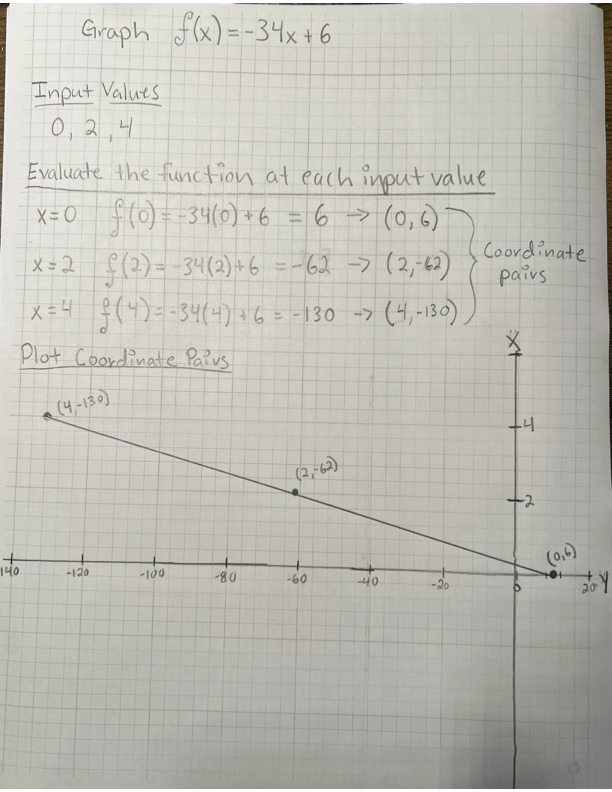

<h3 align="center"><a href="https://github.com/HexxKing/hexxs_study_notes#-1">👈 Back to Table of Contents</a></h3>

---

# Lines, Systems, and Piece-wise Functions

## Tasks

### Determine the equation of a line given its graph

  - Identify two points on the line, preferably where it intersects the x and y axes.
  - Calculate the slope using the formula: `m = (y2 - y1) / (x2 - x1)`
  - Use the slope and one of the points in the point-slope form: `y - y1 = m(x - x1)`
  - Solve for y to get the equation in slope-intercept form: `y = mx + b`

### Graph lines given their equation

  - Identify the slope (m) and y-intercept (b) from the equation.
  - Plot the y-intercept on the y-axis.
  - Use the slope to find a second point: move m units up (or down if negative) and 1 unit to the right from the y-intercept.
  - Draw a straight line through those two points.

### Find the equation of a line in slope-intercept form using point-slope form

  - Substitute the given point and slope into the point-slope form.
  - Distribute any coefficients and simplify.
  - Solve for y to get the equation in slope-intercept form.

### Determine the solution of a system of linear equations by graphing

  - Graph each equation on the same coordinate plane.
  - The solution is the point where the two lines intersect (if they do).

### Determine the solution of a system of linear equations by substitution

  - Solve one equation for one variable.
  - Substitute that expression into the other equation.
  - Solve the resulting equation for the remaining variable.
  - Substitute back into the first equation to find the value of the other variable.

### Determine the solution of a system of linear equations by elimination/addition

  - Manipulate the equations so that one variable has the same coefficient in both equations, but with opposite signs.
  - Add (or subtract) the equations to eliminate that variable.
  - Solve the resulting equation for the remaining variable.
  - Substitute back into one of the original equations to find the value of the other variable.

### Evaluate piecewise functions

  - Identify the appropriate piece of the function based on the input value.
  - Substitute the input value into the corresponding expression and evaluate.

### Graph piecewise functions

  - Graph each piece of the function separately on its corresponding domain.
  - Use open or closed circles at the endpoints of each piece to indicate inclusion or exclusion.

## Vocabulary

### Lines

- **Slope:** The rate of change of a line, calculated as the rise over run.
- **Y-intercept:** The point where the line crosses the y-axis (y-value when x=0).
- **X-intercept:** The point where the line crosses the x-axis (x-value when y=0).
- **Parallel lines:** Lines with the same slope but different y-intercepts.
- **Perpendicular lines:** Lines with negative reciprocals of each other's slopes.
- **Angle of inclination:** The angle formed between the positive x-axis and the line.

### Systems

- **Simultaneous equations:** Equations with two or more unknowns that need to be solved simultaneously.
- **Solution:** The set of values that makes all the equations in a system true.
- **Consistent system:** A system with one solution.
- **Inconsistent system:** A system with no solutions.
- **Dependent equations:** Equations that express the same relationship between the variables and can be derived from each other.
- **Independent equations:** Equations that contain distinct information about the variables.

### Piecewise functions

- **Domain:** The set of all possible input values for the function.
- **Range:** The set of all possible output values for the function.
- **Piece:** A separate section of the function with its own formula and domain.
- **Breakpoint:** The value of the input where the function switches from one piece to another.
- **Discontinuity:** A point where the function has a sudden jump or gap in its output.
- **Step function:** A piecewise function made up of horizontal lines.
- **Absolute value function:** A piecewise function defined by two linear pieces on either side of the y-axis.

## Formulas

### Lines

- **Point-slope form:** `y - y1 = m(x - x1)` (where m is the slope and (x1, y1) is a point on the line)
- **Slope-intercept form:** `y = mx + b` (where m is the slope and b is the y-intercept)
- **Slope formula:** `m = (y2 - y1) / (x2 - x1)` (using coordinates from two points on the line)
- **Distance formula:** `d = sqrt((x2 - x1)^2 + (y2 - y1)^2)` (finding the distance between two points)

### Systems

- **Substitution method:** Solve one equation for one variable, substitute into the other equation, solve for the remaining variable, then substitute back to find the first variable.
- **Elimination method (addition):** Add the equations together if the coefficients for one variable have opposite signs, solve for the remaining variable, then substitute back into one of the original equations to find the first variable.
- **Elimination method (multiplication):** Multiply one equation by a constant factor so that the coefficients for one variable in both equations become multiples of each other, then subtract the equations, solve for the remaining variable, then substitute back into one of the original equations to find the first variable.

### Piecewise functions

- Identify the appropriate piece of the function based on the input value
- Substitute the input value into the corresponding expression and evaluate.

### Additional Formulas

- **Absolute value function:** `f(x) = |x| = { x if x >= 0, -x if x < 0}`
- **Step function:** `f(x) = { h1 if x < a1, h2 if a1 <= x < a2, ..., hn if an-1 <= x < an}` (where h1, h2, ..., hn are different constant values and a1, a2, ..., an are the breakpoints)

## Reading Notes

### [Graphing Lines](https://openstax.org/books/precalculus-2e/pages/2-2-graphs-of-linear-functions)

#### Graph linear functions
  - The graph of a linear function is a straight line.
  - There are three basic methods of graphing linear functions. 
    - By plotting points and then drawing a line through the points. 
    - By using the y-intercept and slope. 
    - By using transformations of the identity function `𝑓(𝑥)=𝑥`.
  - To find points of a function, we can choose input values, evaluate the function at these input values, and calculate output values. The input values and corresponding output values form coordinate pairs. We then plot the coordinate pairs on a grid. 
  - Choosing three points is often advisable because if all three points do not fall on the same line, we know we made an error.
  
  **HOW TO:** Given a linear function, graph by plotting points.

    1. Choose a minimum of two input values.
    2. Evaluate the function at each input value.
    3. Use the resulting output values to identify coordinate pairs.
    4. Plot the coordinate pairs on a grid.
    5. Draw a line through the points.
  
  **Practice:** Graph `𝑓(𝑥)=−34𝑥+6` by plotting points.

#### Write the equation for a linear function from the graph of a line.
#### Given the equations of two lines, determine whether their graphs are parallel or perpendicular.
#### Write the equation of a line parallel or perpendicular to a given line.
#### Solve a system of linear equations.

### [Solving Systems of Linears](https://openstax.org/books/precalculus-2e/pages/9-1-systems-of-linear-equations-two-variables)

### [Piece-Wise Functions](https://openstax.org/books/precalculus-2e/pages/1-2-domain-and-range?query=piecewise%20functions&target=%7B%22index%22%3A0%2C%22type%22%3A%22search%22%7D#fs-id1165134042316)

## Resources

- [Graphing Lines](https://openstax.org/books/precalculus-2e/pages/2-2-graphs-of-linear-functions)
- [Solving Systems of Linears](https://openstax.org/books/precalculus-2e/pages/9-1-systems-of-linear-equations-two-variables)
- [Piece-Wise Functions](https://openstax.org/books/precalculus-2e/pages/1-2-domain-and-range?query=piecewise%20functions&target=%7B%22index%22%3A0%2C%22type%22%3A%22search%22%7D#fs-id1165134042316)
- [Bard: AI Experiment](https://g.co/bard/share/37c348beb2b7)