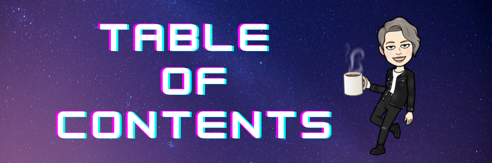

<h3 align="center"><a href="./README.md">👈 Back to README</a><h3>

<h2 align="center"> This Table of Contents is meant to help navigate through my study notes.</h2>

---

# 🌟 Data Structures, Algorithms and Code Challenges
  - I have a whole [repo](https://github.com/HexxKing/data_structures_and_algorithms) dedicated to this topic. Check out the Table of Contents to filter my notes by catagory.

---

# 🌟 Git Commands
  - [How to update a local repo with new changes made to a forked repo on GitHub?](./git-commands/update-local-repo-from-forked.md)

---

# 🌟 IT & Ops
  - CompTIA A+
    - [Laptop Hardware](./it_and_ops.md/laptop_hardware.md)

---

# 🌟 Networking
  - [IP Address Conversion to Binary](./networking/IP_address_conversion_to_binary.md)

---

# 🌟 Python 
  - [List Comprehension](./python/list_comprehension.md)
  - [Slicing](./python/slicing.md)
  - [Filter()](./python/filter.md)

---

# 🌟 Kaggle
  - [Getting Started on Kaggle](./kaggle/getting_started_kaggle.md)
  - [Into to Machine Learning](./kaggle/intro_to_machine_learning.md)

